# Benutzerdokumentation

## Zweck der aktuellen Version

Die aktuelle Version ist ein erstes 2D-Zeichen-MVP für Gebäude-Grundrisse. Es lassen sich bereits Wände auf einer pann- und zoombaren Zeichenfläche mit Raster, Snap, manueller Maßeingabe und orthogonalem Zeichnen erfassen.



## Anwendung starten

```bash
./gradlew run
```

## Grundbedienung

### Navigation

* Mit dem Mausrad zoomst du in die Zeichnung hinein oder heraus.
* Mit der rechten Maustaste verschiebst du die Zeichenfläche.
* Mit `Alt` + rechter Maustaste entfernst du eine nahe Hilfslinie.
* Mit `Ansicht zentrieren` setzt du Zoom und Position auf die Ausgangslage zurück.
* Über die Etagenauswahl wechselst du zwischen vorhandenen Geschossen.
* Mit `Etage hinzufügen` legst du ein weiteres Geschoss an.

### Wände zeichnen

* Im Feld `Werkzeug` wählst du zwischen `Bearbeiten`, `Wand`, `Raum`, `Tür` und `Fenster`.
* Linke Maustaste drücken und ziehen, um eine Wand zu zeichnen.
* Ohne `Shift` wird die Wand automatisch orthogonal ausgerichtet.
* Mit gedrückter `Shift`-Taste wird frei gezeichnet.
* Während des Zeichnens werden Länge und Winkel live angezeigt.
* Ist im Feld `Länge` ein Wert eingetragen, wird die Wand auf diese Länge gesetzt.
* Ist im Feld `Winkel` ein Wert eingetragen, wird die Wand auf diesen Winkel gesetzt.

### Räume, Türen und Fenster

* Mit dem Werkzeug `Raum` ziehst du einen rechteckigen Raum auf.
* Raumname, Raumhöhe, Bodenstärke und Deckenstärke werden über die Eingabefelder festgelegt.
* Mit dem Werkzeug `Tür` klickst du auf eine bestehende Wand, um dort eine Tür zu platzieren.
* Mit dem Werkzeug `Fenster` klickst du auf eine bestehende Wand, um dort ein Fenster zu platzieren.
* Türbreite, Türhöhe, Schwelle, Fensterbreite, Fensterhöhe und Brüstungshöhe werden über die Eingabefelder festgelegt.

### Hilfslinien und Bearbeiten

* Ziehe aus dem oberen Lineal eine vertikale Hilfslinie in die Zeichnung.
* Ziehe aus dem linken Lineal eine horizontale Hilfslinie in die Zeichnung.
* Mit dem Werkzeug `Bearbeiten` kannst du verbundene Wand-Endpunkte gemeinsam verschieben.

### Raster und Snap

* `Raster` blendet das Zeichenraster ein oder aus.
* `Snap Raster` lässt Punkte auf das aktuelle Raster einrasten.
* `Snap Punkte` lässt Punkte auf vorhandene Linien-Enden einrasten.
* Über `Rasterweite` legst du die Rasterdichte in `mm`, `cm` oder `m` fest.

### Zusätzliche Anzeigen

* `Bemaßung` blendet Längenbeschriftungen für Wände ein oder aus.
* `Fläche & Volumen` blendet die Werte der Räume ein oder aus.
* `Hilfslinien` blendet gezogene Hilfslinien ein oder aus.
* `Nordpfeil` zeigt die Himmelsrichtung in der Zeichenfläche an.
* Über die sechs Ansichtsbuttons kann zwischen den orthogonalen Ansichten umgeschaltet werden.

## Aktuelle Grenzen

Die aktuelle Version konzentriert sich bewusst auf den 2D-Grundrisskern. Noch nicht umgesetzt sind unter anderem:

* Treppen, Dächer und zusätzliche Flächen-Ebenen
* DXF- und DWG-Verarbeitung

## Nächste fachliche Ausbaustufen

Die nächsten geplanten Schritte sind:

* Erweiterung des Fachmodells um Räume, Türen und Fenster
* strukturierter DXF-Import und -Export
* interne Standardbibliothek für Bauteile
* robuste Mehr-Etagen-Unterstützung
