# Systemdokumentation

## Zielbild

`CADas` ist aktuell als Java-Desktop-Anwendung für Gebäude-Grundrisse mit kombinierter 2D- und 3D-Workbench aufgesetzt. Der technische Schwerpunkt liegt weiterhin auf einem sauberen Geometriekern, damit DXF-Import/Export, Teilebibliotheken und die 3D-Ableitung auf konsistenten Fachobjekten aufbauen.



## Aktueller Architekturstand

### Technologien

* `JDK 25`
* `Gradle Wrapper 9.5.0`
* `JavaFX` für die Desktop-Oberfläche
* `JUnit 5 Jupiter` für Unit-Tests
* `JaCoCo` für Testreports

### Paketstruktur

* `de.andreas.cadas`
  Einstiegspunkte der Anwendung.
* `de.andreas.cadas.ui`
  JavaFX-Workbench, Ansichten und Interaktion mit der Zeichenfläche.
* `de.andreas.cadas.application.drawing`
  Anwendungslogik für orthogonales Zeichnen, manuelle Längen- und Winkeleingabe, Snap-Verhalten, Öffnungsplatzierung und Bearbeitung verbundener Wand-Endpunkte.
* `de.andreas.cadas.application.exchange`
  Formatunabhängige Schnittstellen für Import und Export.
* `de.andreas.cadas.application.parts`
  Interne Standard-Teilebibliothek sowie Import zusätzlicher Presets für Türen, Fenster und Treppen.
* `de.andreas.cadas.domain.geometry`
  Geometrische Grundbausteine wie Längen, Winkel, Raster, Punkte und Segmente.
* `de.andreas.cadas.domain.model`
  Fachliches Projektmodell für Etagen, Räume, Wände, Türen, Fenster und Treppen.
* `de.andreas.cadas.infrastructure.dxf`
  Konkreter Adapter für ASCII-DXF-Import und -Export.
* `de.andreas.cadas.application.layers`
  Berechnung rechteckiger Kachelbelegungen für zusätzliche Oberflächen-Ebenen.

## Verantwortlichkeiten

### UI

Die Klasse `CadWorkbench` kapselt die aktuelle Workbench. Sie stellt bereit:

* pann- und zoombare Zeichenfläche
* Rasterdarstellung
* Hilfslinien aus Linealen
* magnetisches Snap auf Raster und Endpunkte
* sechs orthogonale Ansichtsumschalter
* optionale Himmelsrichtung
* Live-Anzeige von Länge und Winkel
* ein- und ausblendbare Bemaßung für Wände
* Werkzeugmodus für Wände, Räume, Türen, Fenster und Bearbeitung
* parallele 3D-Ansicht mit Orbit, Zoom, Pan und Auswahlrückkopplung
* DXF-Import und DXF-Export für die aktive Etage
* Standardteil-Presets für Türen, Fenster und Treppen
* erste Treppenplatzierung für gerade, 180°- und Wendeltreppen
* Flächen- und Volumenanzeige für Räume

### Anwendungslogik

`DraftingService` erzwingt je nach Eingabemodus orthogonales Zeichnen oder übernimmt manuelle Längen- und Winkelvorgaben. `SnapService` entscheidet, ob auf bestehende Endpunkte oder auf das Raster eingerastet wird. `OpeningPlacementService` bindet Türen und Fenster an bestehende Wände. `WallEditingService` verschiebt verknüpfte Wand-Endpunkte gemeinsam. `ThreeDSceneModelBuilder` leitet aus denselben Domänenobjekten einen renderbaren 3D-Szenengraphen ab, und `ThreeDCameraController` kapselt Orbit-, Pan-, Zoom- und Projektionswechsel der 3D-Kamera.

### Domäne

`Length` speichert Maßangaben in Millimetern auf Basis von `BigDecimal`, um Einheiten konsistent zu halten. `ProjectModel`, `Level`, `Wall`, `Room`, `Door`, `WindowElement`, `Staircase`, `Roof` und `SurfaceLayerStack` bilden den aktuellen Grundrisskern ab. Etagen lassen sich bereits dynamisch anlegen und getrennt voneinander bearbeiten.

## Dach- und Ebenenmodell

Der aktuelle Domänenstand enthält bereits die fachlichen Grundlagen für die nächsten Ausbaustufen:

* `Roof` modelliert das erste Satteldach mit Winkel, Überstand und Dachrinne.
* `SurfaceLayer` und `SurfaceLayerStack` modellieren zusätzliche Aufbau-Ebenen auf Flächen.
* `TileLayoutService` berechnet rechteckige Kachel- beziehungsweise Plattenbelegungen mit Versatz und Mindestversatz.

Diese Teile sind bewusst zunächst im Modell und in Tests abgesichert, bevor dafür eine eigene Oberfläche ergänzt wird.

## Dateiformatstrategie

Der erste konkrete Austauschadapter ist `DxfLevelExchangeService`. Er kapselt den DXF-Import und -Export bewusst hinter `LevelExchangeService`, damit eine spätere `DWG`-Unterstützung als weiterer Infrastrukturadapter ergänzt werden kann.

Für den aktuellen Stand gilt:

* Wände, Räume, Türen und Fenster werden sichtbar als DXF-Geometrie exportiert.
* Zusätzlich schreibt CADas eine eigene Layer-Spur `CADAS_META`, um fachliche Zusatzinformationen verlustarm wieder einzulesen.
* Fällt diese Metadaten-Spur weg, importiert der Adapter zumindest einfache Wände und Räume aus der reinen Geometrie.

## Teilebibliotheken

Die Standardteilversorgung besteht aus drei Ebenen:

* interne Standard-Presets für Türen, Fenster und Treppen
* UI-Auswahllisten, die diese Presets direkt auf Eingabefelder anwenden
* externer Import über `.cadasparts`, damit weitere Bibliotheken ohne Codeänderung ergänzt werden können

## Rendering-Modell

Die 2D-Zeichenfläche arbeitet intern in Millimetern und transformiert diese Weltkoordinaten mit Offset und Zoom auf Bildschirmkoordinaten. Dadurch bleiben Raster, Snap und Bemaßung konsistent, auch wenn die Ansicht verschoben oder skaliert wird.

Die 3D-Ansicht nutzt dieselben Millimeterkoordinaten und leitet daraus Box-Geometrien für Wände, Räume, Öffnungen, Treppen, Dachflächen und optionale Oberflächen-Ebenen ab. Die Darstellung läuft als JavaFX-`SubScene` mit umschaltbarer orthografischer oder perspektivischer Kamera. Sichtbarkeit wird je Geschoss gesteuert, und die Auswahl ist zwischen 2D- und 3D-Darstellung synchronisiert.

## Qualitätssicherung

Aktuell abgesichert sind unter anderem:

* Einheitenumrechnung und Formatierung
* orthogonales Zeichnen
* freie Längen- und Winkelvorgaben
* Snap auf Raster und Endpunkte
* Platzierung von Türen und Fenstern auf Wänden
* Verschieben verbundener Wand-Endpunkte
* Flächen- und Volumenberechnung von Räumen
* DXF-Roundtrip für die Grundobjekte des MVP
* Standardteil-Bibliothek für Türen, Fenster und Treppen
* Dach- und Ebenendomäne für weitere Ausbaustufen
* 3D-Geometrieableitung für Wände, Räume, Öffnungen, Treppen und Dach
* Kameragrundverhalten für Orbit, Pan, Zoom und Projektionswechsel
* Grundverhalten des Projektmodells

Build und Tests laufen über:

```bash
./gradlew test
```

## Erweiterungsstrategie

Die bestehende Struktur ist absichtlich so geschnitten, dass die nächsten Ausbauschritte sauber ergänzt werden können:

* die vorhandene `DWG`-Datei später über eine separat gekapselte Formatadapter-Schicht nutzbar machen
* komplexere 3D-Geometrie jenseits von Box-Ableitungen ergänzen
* grafische Verwaltungsoberflächen für Dach- und Oberflächen-Ebenen ergänzen

## Plattformstrategie

Die Anwendung wird plattformneutral aufgebaut. Aktive Verifikation erfolgt zunächst auf `macOS`, die Architektur trennt jedoch bereits UI, Anwendungslogik und Domäne so, dass spätere Plattformtests auf `Windows` und `Linux` nicht an vermischten Zuständigkeiten scheitern.
