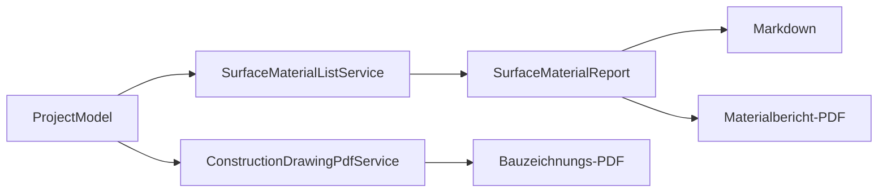

# Berichte und PDF-Ausgabe

## Verantwortung

`ResidentialAreaService` berechnet anrechenbare Wohnfläche geometrisch nach den in CADas
hinterlegten WoFlV-Höhenschwellen. `SurfaceMaterialListService` sammelt Raum-, Belags-, Heizungs- und
Reststückdaten in einem unveränderlichen Bericht. `MarkdownHtmlRenderer` rendert Markdown für die
Workbench. `SurfaceMaterialReportPdfService` und `ConstructionDrawingPdfService` schreiben
prüfbare PDF-Dateien.

## Berechnungsfluss

## Fachregeln

* Raumfläche, Wohnfläche und Volumen sind getrennte Kennzahlen.
* Dachschrägen werden als untere Hülle aller Profile ausgewertet; Bereiche unter einem Meter zählen
  nicht, zwischen einem und zwei Metern zur Hälfte, ab zwei Metern vollständig.
* Außenbalkone werden regulär mit 25 Prozent angesetzt.
* Öffnungen und ausschneidende Objekte reduzieren nur die fachlich betroffene Fläche.
* Materialgruppen werden nicht allein nach Anzeigename zusammengelegt, sondern nach allen
  beschaffungsrelevanten Eigenschaften getrennt.
* PDF-Dateien werden zuerst temporär geschrieben und anschließend atomar ersetzt.

## Review

Leere Projekte, mehrere Etagen, gleichnamige unterschiedliche Materialien, Innenlöcher, Reststücke,
Seitenumbrüche, sehr lange Texte, Umlaute, fehlende Rasterbilder und nicht beschreibbare Ziele
prüfen. Markdown- und PDF-Summen müssen denselben Berichtsdaten entsprechen.
