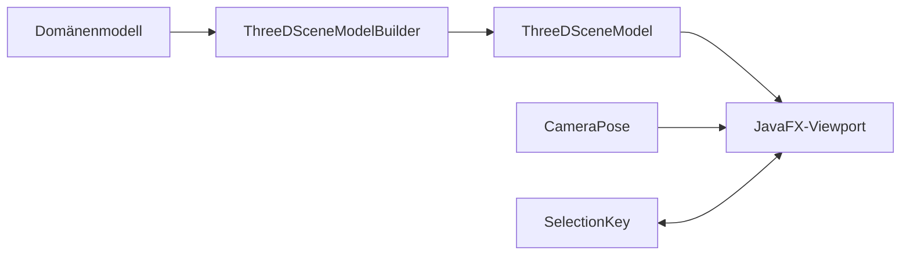

# Ansichtsableitung

Dieses Paket bildet Fachobjekte in darstellbare, aber JavaFX-unabhängige Ansichtsmodelle ab.
`ThreeDSceneModelBuilder` erzeugt Boxen und Dreiecksnetze, `ThreeDCameraController` verändert
unveränderliche Kameraposen, und Fit-/Interior-Dienste berechnen Sichtbereich und raumgebundene
Bewegung. Wandoberflächendienste schneiden Öffnungen aus Belägen und leiten Grundrissstreifen ab.

## Schichten

## Invarianten

Ansichtsmodelle enthalten Weltmaße, keine Pixel. Eine `SelectionKey` muss stabil zum
Domänenobjekt zurückführen. Öffnungen werden sowohl aus Wandkörpern als auch Belagsnetzen
ausgespart. Sichtbarkeitsfilter dürfen Geometrie nicht verändern. Innenkameras bleiben in der
zulässigen Raumkontur und wechseln nur über fachlich verbundene Türen.

## Review

Alle sechs orthogonalen Ansichten, Perspektive und Orthografie, mehrere Etagen, leere Szenen,
große Koordinaten, konkave Räume, polygonale Wandköpfe und Innenlöcher in Netzen prüfen.
