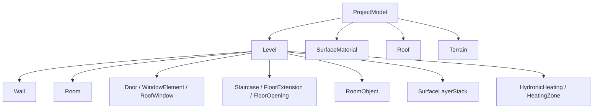

# Fachmodell `de.schrell.cadas.domain.model`

## Verantwortung

Dieses Paket beschreibt den vollständigen fachlichen Zustand eines CADas-Projekts. Es enthält
keine JavaFX-Knoten, Pixelkoordinaten oder DXF-Gruppencodes. Modelle validieren ihre lokalen
Invarianten beim Erzeugen; Beziehungen innerhalb einer Etage werden zusätzlich von `Level`
geprüft.

## Aggregatstruktur

`ProjectModel` ist die Gebäude-Wurzel. `Level` besitzt die etagenbezogenen Bauteile.
`SurfaceMaterial` ist der zentrale Katalog für gemeinsam verwendete Beläge. Öffnungen referenzieren
ihre Host-Wand über stabile UUIDs, Oberflächenstapel ihre Trägerfläche über Typ und Fachschlüssel
sowie ihr Material über eine stabile UUID, Heizungen ihren Raum.

## Wesentliche Invarianten

* IDs müssen innerhalb ihres fachlichen Objekttyps stabil und eindeutig bleiben.
* Türen und Fenster benötigen eine vorhandene Host-Wand und müssen einschließlich Höhe vollständig
  in Achslänge und Wandprofil liegen.
* Wandprofile beginnen bei Achsposition null, enden an der Achslänge und besitzen keine rückwärts
  laufenden Profilabschnitte.
* Raumkonturen müssen mindestens drei Punkte besitzen; Höhe und Aufbaustärken dürfen keine negative
  lichte Höhe erzeugen.
* Heizkreise und Sperrflächen gehören zu vorhandenen Räumen. Rohrmaße, Leistungen und Längen müssen
  endlich und nicht negativ sein.
* Änderungsmethoden erzeugen bei Records neue Werte; Sammlungsaggregate geben keine unkontrolliert
  veränderbaren internen Listen heraus.

## Ableitungen

Fläche, Volumen, Wohnfläche, Rendering-Netze und Materialmengen sind abgeleitete Ergebnisse und
werden in den Anwendungspaketen berechnet. Im Fachmodell verbleiben nur Werte, die gespeichert und
vom Anwender bearbeitet werden müssen, etwa Raumkontur, Dachschrägenprofile oder Heizkreisparameter.

## Persistenzkompatibilität

Neue Record-Komponenten verändern die DXF-Metadaten. Jede Erweiterung benötigt daher:

1. einen neuen, rückwärtskompatiblen Metadatenleser,
2. einen Roundtrip-Test für Projekt und Einzeletage,
3. einen definierten Standardwert für ältere Dateien,
4. eine Prüfung von IDs und Querverweisen nach dem Import.

## Menschliches Review

Bei Modelländerungen zuerst Konstruktorvalidierung, Einheiten und Querverweise prüfen. Danach alle
`with...`-, `replace...`- und `reconfigure...`-Methoden vergleichen: Kein Feld darf beim Kopieren
unbeabsichtigt auf einen Standardwert zurückfallen. Abschließend DXF-Roundtrip, Undo-Snapshot und
Berichtsausgabe prüfen.
