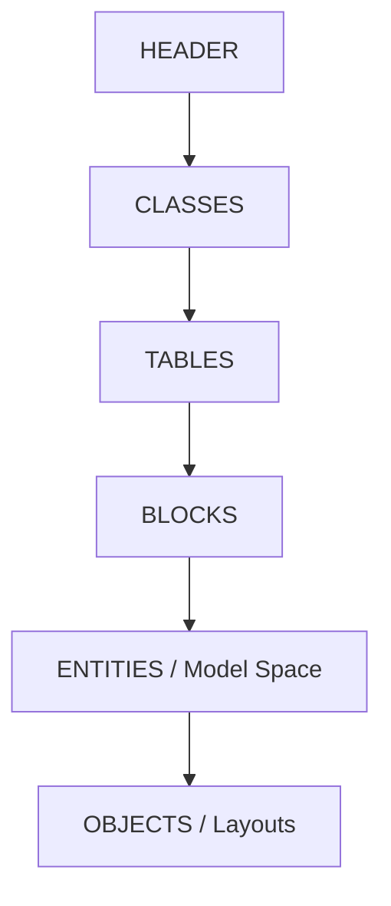

# DXF-Infrastruktur

## Aufgabe

Dieses Paket ist der konkrete Dateiformatadapter zwischen CADas-Domäne und ASCII-DXF.
`DxfProjectExchangeService` behandelt vollständige Gebäude, `DxfLevelExchangeService` einzelne
Etagen. `DxfDocumentSupport` kapselt Struktur, Handles, Tabellen, Model Space und Einheiten.
`DxfMetadataCodec` sowie spezialisierte Metadatencodecs erhalten Fachwerte, die sichtbare
DXF-Geometrie allein nicht ausdrücken kann.

## Exportstruktur

Neue Dateien verwenden AutoCAD 2000 (`AC1015`), explizite metrische Einheiten, eindeutige Handles,
vollständige Eigentümerbeziehungen und grundlegende Layout-Dictionaries. Fachobjekte erscheinen
als sichtbare Geometrie; zusätzlich liegen versionierte, URL-kodierte `CADAS_META`-Texte vor.

## Importstrategie

1. Struktur und Einheiten lesen.
2. Aktuelle oder ältere CADas-Metadaten einzeln dekodieren.
3. Gültige fachliche Objekte und Querverweise aufbauen.
4. Bei fehlenden oder teilweise beschädigten Metadaten sichtbare Wände und Räume aus Geometrie
   retten und mit bereits gelesenen Fachobjekten ohne Duplikate zusammenführen.
5. Türen und Fenster nur übernehmen, wenn Host-Wand und vollständige Öffnungsgeometrie gültig sind.

## Invarianten und Sicherheit

* Exporte werden im Zielverzeichnis temporär erzeugt und atomar verschoben.
* Ein Importfehler in einem Metadatensatz darf nicht alle unabhängigen Geometrien verwerfen.
* `$INSUNITS` wird für alle definierten DXF-Einheiten korrekt in Millimeter umgerechnet.
* Fremde Texte, IDs und Zahlen werden validiert; Querverweise werden erst nach vorhandenen Hosts
  eingesetzt.
* Metadatenversionen bleiben rückwärts lesbar. Eine Formatänderung benötigt Roundtrip- und
  Altformat-Testdaten.

## Review

Mit CADas-Roundtrip, reinem Fremd-DXF, beschädigten Metadaten und einem unabhängigen DXF-Prüfer
testen. Zusätzlich Einheiten, Umlaute, Pipes, leere Layer, unbekannte Entities, doppelte Handles,
Konkurrenz beim Überschreiben und Schreibfehler im Zielverzeichnis prüfen.
