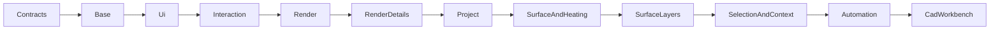

# JavaFX-Benutzeroberfläche

## Rolle

Das UI-Paket verbindet JavaFX-Ereignisse mit den fachlichen Diensten. Es besitzt die aktuelle
Workbench, 2D-Canvas-Rendering, den 3D-Viewport, Dialoge, Berichtsfenster und die explizit aktivierte
lokale Automation. Fachliche Geometriealgorithmen sollen in `application.*` bleiben.

## Workbench-Aufteilung

`CadWorkbench` ist der öffentliche JavaFX-Knoten. Seine Implementierung ist wegen der Größe nach
Verantwortungsbereichen über eine interne abstrakte Klassenkette verteilt:

Die Kette teilt gemeinsamen Zustand per Vererbung. Sie ist funktional, erhöht aber die Kopplung;
größere Umbauten benötigen zuerst gezielte Charakterisierungstests und sind in `REVIEW.md` als
Architekturthema beschrieben.

## UI-Bereiche

* `CadWorkbenchUi` erzeugt Menü, Werkzeugleisten und kontextabhängige Eigenschaften.
* `CadWorkbenchInteraction` übersetzt Maus und Tastatur in Anwendungsdienste.
* Renderklassen zeichnen 2D-Geometrie aus demselben Projektzustand.
* `ThreeDViewport` wandelt das JavaFX-unabhängige 3D-Ansichtsmodell in Szene, Kamera und Auswahl um.
* `CadWorkbenchDocumentSupport` öffnet Hilfe und Berichte; eingebettetes JavaScript erhält nur
  vollständig kodierte Stringliterale.
* `HeatingCircuitRoutingWindow` ist ein technisches Werkzeug für die Routing-Sprache.
* `AutomationBridgeServer` bietet token-geschützte lokale Testaufrufe auf `127.0.0.1`.

## Threading und Zustand

Alle JavaFX-Knoten werden ausschließlich auf dem JavaFX-Anwendungsthread gelesen oder verändert.
Lang laufende Exporte und Analysen verwenden Hintergrundaufgaben und melden Ergebnisse zurück.
Jede fachliche Mutation erzeugt vorab genau einen vollständigen Undo-Snapshot. Reines Zoomen,
Auswählen oder Ein-/Ausblenden erzeugt keinen fachlichen Projektzustand.

## Bedienbarkeit

Alle Buttons, Eingabefelder, Auswahlboxen, Optionen und Menüaktionen besitzen ausführliche deutsche
Tooltips. Dialoge nennen Auswirkung und Abbruchverhalten. Fehlerdialoge zeigen eine verständliche
Meldung und bieten den technischen Stacktrace separat zum Kopieren an.

## Automation und Sicherheit

Der Server startet nur bei expliziter Aktivierung und verlangt ein zufälliges Bearer-Token mit
mindestens 32 Zeichen. Er unterscheidet lesende `GET`- und ändernde `POST`-Aufrufe, validiert Origin,
Dateipfade und symbolische Links und begrenzt Wartezeiten auf den JavaFX-Thread. Neue Endpunkte
benötigen Authentifizierungs-, Methoden-, Pfad- und Timeout-Tests.

## Review

Reviewer prüfen JavaFX-Threadzugriff, Listener-Lebensdauer, Undo-Grenzen, deaktivierte Aktionen,
Tooltips, Tastaturkürzel, leere Auswahl, Dialogabbruch, mehrere Etagen sowie Gleichstand zwischen
2D, 3D, Berichten und gespeichertem Projekt.
